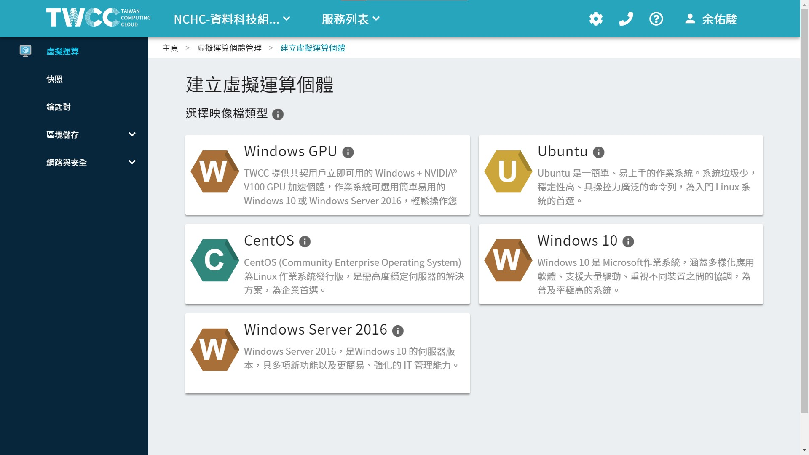

# Initial Status

TWCC-VCS 上面有多個映像檔可做建立的選擇。  <br>
我選擇使用 ubuntu 來建立一個 VCS。



以下是 TWCC 預設會先執行的 script，我盡可能註解。  <br>
另外也註記一開始會安裝哪些東西，或是有哪些設定。

然後記得 VCS 剛啟動的時候，建議最好 `sudo reboot` 重新開機一下，  <br>
之前的經驗是有一些檔案好像還處於 lock 狀態。

--

**Content:**

<!-- TOC -->

- [Initial Status](#initial-status)
  - [script history](#script-history)
    - [ubuntu](#ubuntu)
    - [root](#root)
  - [apt](#apt)
  - [df -h](#df--h)
  - [END](#end)

<!-- /TOC -->

---

## script history

成功啟動 VCS 之後，連線進去會發現在啟動 VCS 服務時，TWCC 已經幫我們做了很多的設定，  <br>
透過 history 我們可以略知一二。

### ubuntu

這個檔案在 ubuntu 使用者的家目錄下。  <br>

```{bash}
cd /home/ubuntu/
cat .bash_history
```

```{bach}
ls
sudo vim /etc/ssh/  --vim 一個資料夾，會顯示該資料夾下的所有檔案列表。
sudo su  --進入超級權限管理者。
exit  --退出超級權限管理者
ls
vim /etc/hosts  --顯示該資料夾下的所有檔案列表。
sudo vim /etc/hosts  --顯示該資料夾下的所有檔案列表。這和網路有相關。
exit  --以 ubuntu 使用者退出 VCS，之後再進來
sudo vim /etc/hosts  --顯示該資料夾下的所有檔案列表。
vim /etc/sysctl.conf  --網路相關的設定，最後面加了三行。(我猜啦)
sudo vim /etc/sysctl.conf

  > net.ipv6.conf.all.disable_ipv6 = 1  <br>
  > net.ipv6.conf.default.disable_ipv6 = 1  <br>
  > net.ipv6.conf.lo.disable_ipv6 = 1

sudo reboot  --重新開機。
sysctl  -- Linux 下的 sysctl 指令可以用作檢視及修改執行中的 Kernel 變數。
sysctl -a|grep "ipv6\|disable"  --grep列出上述列表符合條件的Kernel變數。
sysctl -a|grep "ipv6\|disable\| 1"
sudo vim /etc/apt/sources.list  --apt 的 resource 來源，加上 http://free.nchc.org.tw/ubuntu。
sudo apt-get install zsh  --安裝zsh模組。不知道下面為何要新安裝卸除好幾次。
sudo apt-get remove zsh
sudo vim /etc/apt/sources.list
sudo apt-get install zsh
sudo apt-get update
sudo apt-get install zsh
sudo apt-get remove zsh
sudo apt-get install zsh
sudo apt-get remove zsh
exit
date
exit
apt-get install ntp
sudo apt-get install ntp  --安裝ntp、ntpd模組。ntp: Network Time Protoco。提供網路上可以進行網路校時的主機功能。
sudo apt-get install ntpd
sudo apt-get install ntp
sudo apt-get update
sudo apt-get install ntp

  > NTP 服務（ntpd）本身就有自動校時的功能，若啟用 NTP 服務後，就不可以使用 ntpdate 的方式校時，兩者僅能擇一使用。

ls
vim /etc/apt/sources.list
exit
ping free.nchc.org.tw
vim /etc/apt/sources.list
sudo vim /etc/apt/sources.list
sudo apt-get update
sudo apt-get install ntp
sudo ntpdate 140.110.16.1  --手動校正時間。
sudo apt-get install ntpdate
sudo ntpdate 140.110.16.1
systemctl stop ntp  --停止自動校正時間。
sudo systemctl stop ntp
sudo ntpdate 140.110.16.1
sudo yum update -y
tmux  --tmux 終端機管理工具，分割視窗、同時開啟多個終端機。
exit
sudo apt-get upgrade -y
date
sudo dpkg-reconfigure tzdata  --改變timezone。
date
vim /etc/ntp.conf  --設定ntp對準時間的相關參數與來源。
sudo vim /etc/ntp.conf
sudo systemctl restart ntp
sudo systemctl status ntp
vim /etc/hosts
hostname  --知道此 VCS 的名稱
vim /etc/hosts  --知道網路的設定
sudo vim /etc/hosts
ntpq -p  --列出目前我們的 NTP 與相關的上層 NTP 的狀態。列印出該伺服器已知的節點列表和它們的狀態概要信息。
cat /etc/hosts
sudo vim /etc/apt/sources.list
sudo su
cat /etc/apt/sources.list
exit
```

--

### root

這個檔案在 ubuntu 使用者的家目錄下。  <br>

```{bash}
cd /root/
cat .bash_history
```

> 指令 `systemctl <操作指令> <服務名稱.service>`  <br>
>  <br>
> 在 Systemd 中每一個系統服務就稱為一個服務單位（unit），而服務單位又可以區分為 service、socket、target、path、snapshot、timer 等多種不同的類型（type），我們可以從設定檔的附檔名來判斷該服務單位所屬的類型，最常見的就是以 .service 結尾的系統服務，大部分的伺服器都是屬於這種。  <br>
>  <br>
> 如果要管理 Systemd 中的各種服務，可以使用 systemctl 這個指令，配合各種操作指令來進行各種操作。

```{bach}
 1  vim /etc/ssh/sshd_config  --修改ssh連線的config。
 2  systemctl |grep ssh  --列出 ssh 連線這個服務的狀態。
 3  systemctl restart ssh  --重啟 ssh 連線服務。
 4  exit
 5  apt upgrade
 6  apt-get upgrade
 7  apt-get install zip
 8  apt-get update
 9  vim /etc/apt/sources.list
10  apt-get update
11  exit
12  sudo vi /etc/systemd/system/rc-local.service
13  sudo vi /etc/rc.local
14  sudo chmod +x /etc/rc.local
15  sudo systemctl enable rc-local
16  sudo systemctl start rc-local.service  --重啟服務。  <br>
17  sudo systemctl status rc-local.service
18  sudo vi /etc/rc.local
19  sudo systemctl status rc-local.service
20  sudo systemctl start rc-local.service
21  sudo systemctl status rc-local.service
22  sudo vi /etc/rc.local
23  sudo systemctl start rc-local.service
24  sudo systemctl status rc-local.service
25  reboot
```

---

## apt

**list:**

列出所有的套件。  <br>
list packages based on package names

```{bash}
apt list  //列出所有可安裝的套件。
apt list --installed  //列出所有安裝的套件。
```

靈活運用。

```{bash}
// 列出可安裝的套件，共 67371 個。
apt list
apt list | wc -l

// 列出有安裝的套件，並計算個數，共 516 個。
apt list --installed | wc -l

// 列出 dcoker 開頭的套件。
apt list | grep ^docker
```

一開始安裝的套件有 516 個。  <br>
其中並沒有 docker。  <br>
比較重點有的是 vim, zsh, python3.6, perl, openssl, ntp, nano, gzip, git, ftp, gcc-8-base, dpkg, fdisk, curl, apt。

- [apt list - apt 使用筆記](https://foreachsam.github.io/book-util-apt/book/content/command/apt/apt-list/)
- [apt - How to list all installed packages - Ask Ubuntu](https://askubuntu.com/questions/17823/how-to-list-all-installed-packages)

```{bash}
//列出可安裝的套件，共 67371 個。
apt list
apt list | wc -l
```

**更新:**

```{bash}
apt-get update
```

**安裝 vim:**

```{bash}
// 一定要先更新 apt-get 這個工具，不然後面其實會出問題。
apt-get update

// 安裝
apt-get install vim
```

---

## df

磁碟使用的初始狀況、可以看容量

-h, --human-readable  print sizes in powers of 1024 (e.g., 1023M)

```{bash}
df -h

Filesystem      Size  Used Avail Use% Mounted on
udev            7.9G     0  7.9G   0% /dev
tmpfs           1.6G  740K  1.6G   1% /run
/dev/vda1        97G  3.1G   94G   4% /
tmpfs           7.9G     0  7.9G   0% /dev/shm
tmpfs           5.0M     0  5.0M   0% /run/lock
tmpfs           7.9G     0  7.9G   0% /sys/fs/cgroup
/dev/vda15      105M  3.6M  101M   4% /boot/efi
tmpfs           1.6G     0  1.6G   0% /run/user/1000
```

---

## END
