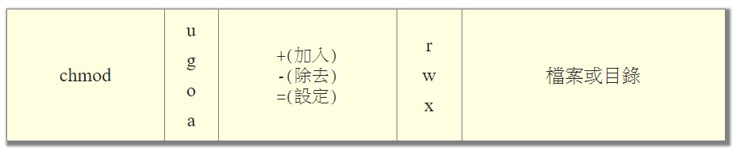

# Permission

### 檔案

- [鳥哥的 Linux 私房菜 -- 第五章、Linux 的檔案權限與目錄配置](http://linux.vbird.org/linux_basic/0210filepermission.php)
- -R, --recursive        change files and directories recursively

Linux檔案的基本權限就有九個，分別是 owner/group/others 三種身份各有自己的read/write/execute權限。  <br>
檔案的權限字元為: 『-rwxrwxrwx』，這九個權限是三個三個一組的!  <br>
其中，我們可以使用數字來代表各個權限，各權限的分數對照表: r:4, w:2, x:1。  <br>
每種身份(owner/group/others)各自的三個權限(r/w/x)分數是需要累加的。

還有一個改變權限的方法，基本上就九個權限分別是 user(owner)/group/others 三種身份。  <br>
那麼我們就可以藉由 u, g, o 來代表三種身份的權限，a則代表 all 亦即全部的身份。  <br>
讀、寫、執行的權限就可以寫成r, w, x。



```{bash}
chmod a+x <filename or folder>

//下面兩個語法等價。
chmod a+rwx <filename or folder>
chmod 777 <filename or folder>
```

--

### 目錄之擁有者或群組

- [Linux 更改檔案擁有者與群組，chown 指令使用教學與範例 - G. T. Wang](https://blog.gtwang.org/linux/linux-chown-command-tutorial/)
- -R, --recursive        change files and directories recursively

```{bash}
chown -R ubuntu /data2/bigobject
chown -R ubuntu:ubuntu /data2/bigobject
```


---

## END
