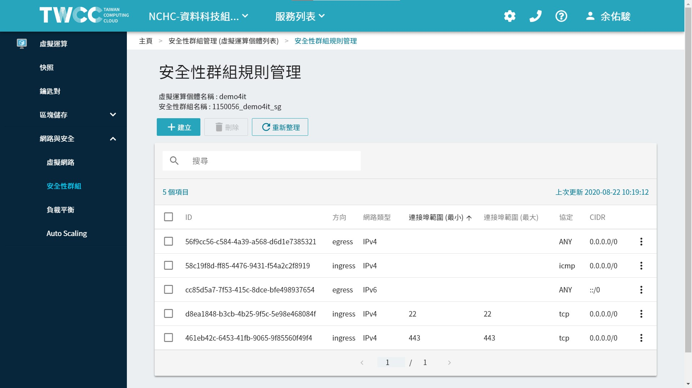

# TWCC-Port Connect

安裝 docker，並啟用 container 之後，有些服務必須打開 port 才可使用，   
則必須回到 TWCC 的設定頁面。

**網路安全 > 安全性群組 > 找到屬於自己的虛擬運算個體(VCS)。**

進入之後，會看到目前有打開的連接埠。預設是22、443。   
也會看到方向 ingress(從外部流進)、egress(從內部流出)。

初始的網路安全-安全性群組設定。

本小節將教學，如何新增規則，以及相關網路的設定。

--

**Content:**

<!-- TOC -->

- [TWCC-Port Connect](#twcc-port-connect)
  - [CIDR設定](#cidr設定)
  - [協定 TCP vs UDP](#協定-tcp-vs-udp)
  - [常見的連接埠功用](#常見的連接埠功用)
  - [END](#end)

<!-- /TOC -->

---

## CIDR設定

**參考資料:**

- [[料理佳餚] 什麼是 CIDR 標記法？（或稱 CIDR 表示法） | 軟體主廚的程式料理廚房 - 點部落](https://dotblogs.com.tw/supershowwei/2019/07/15/173015)

如果要限制IP連線，可如下設定。以下舉例。

- 111.222.333.444/32: 表示限制只能IP為 111.222.333.444。   
- 111.222.333.444/24: 表示限制IP可為以下網域 111.222.333.0。   
- 111.222.333.444/16: 表示限制IP可為以下網域 111.222.0.0。   
- 111.222.333.444/8: 表示限制IP可為以下網域 111.0.0.0。   
- 111.222.333.444/0: 表示限制IP可為以下網域 0.0.0.0。其實就是大家都可以連進來。   
- 0.0.0.0/0: 表示大家都可以連進來。(效果同上)

通常全開我們都會笑稱是在網路上裸奔，是很危險的，因為現在網路上有很多掃 ip 攻擊。

---

## 協定 TCP vs UDP

協定選項有很多，大部分我沒有很熟><>

**TCP Port:**

TCP Port，即傳輸控制協定Port，需要在用戶端和伺服器之間建立連接，這樣可以提供可靠的資料傳輸。  
常見的包括 FTP服務的 21Port，Telnet服務的 23Port，SMTP服務的25Port，以及 HTTP服務的 80Port 等等。

**UDP Port:**

UDP Port，即用戶資料包協定Port，無需在用戶端和伺服器之間建立連接，安全性得不到保障。  
常見的有 DNS服務的 53Port，SNMP(簡單網路管理協定)服務的 161Port，QQ 使用的 8000 和 4000Port 等等。

---

## 常見的連接埠功用

一些常見的服務，都有預設使用的 port，我有想到就補充上來。

- 21: FTP（File Transfer Protocol，檔傳輸協定）服務。
- 22: SSH(Secure Shell) - 安全遠端登入協定，用於安全檔案傳輸（SCP，SFTP）及埠轉發。
- 80: HTTP（HyperText Transport Protocol，超文本傳輸協定）開放的，這是上網衝浪使用最多的協定，主要用於在WWW（World Wide Web，萬維網）服務上傳輸資訊的協定。
- 443: 網頁流覽Port，主要是用於HTTPS服務，是提供加密和通過安全Port傳輸的另一種HTTP。超文字傳輸安全協定。
- 1433: MSSQL
- 3266: plumber
- 3306: mysql
- 4000: gitbook
- 5432: postgres
- 8080：8080Port同80Port，是被用於WWW代理服務的，可以實現網頁流覽。
- 8787: Rstudio
- 8888: jupyter notebook
- 9999: jupyter lab

**TWCC-VM 無法使用的 port:**

就算我安全性群組有打開，還是不能連。完全不懂XD~   
黑名單: 6666

**參考資料:**

- [TCP/UDP埠列表 - 維基百科，自由的百科全書](https://zh.wikipedia.org/wiki/TCP/UDP%E7%AB%AF%E5%8F%A3%E5%88%97%E8%A1%A8)
- [常用 TCP Port作用(各種Port介紹) @ ╭。☆║♡♥㊗-ⓨⓤⓝ-♡♥║☆。╮ :: 痞客邦 ::](https://yun1450.pixnet.net/blog/post/47494172)

---

## END
