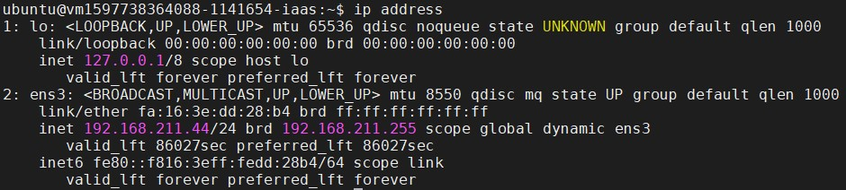
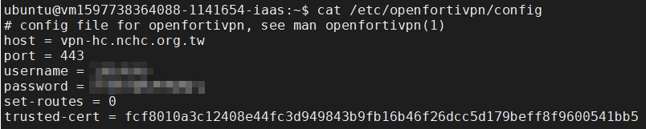
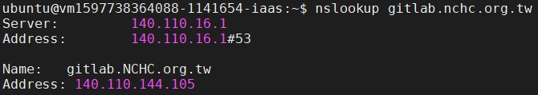
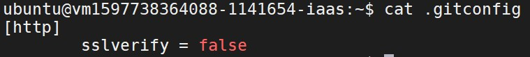
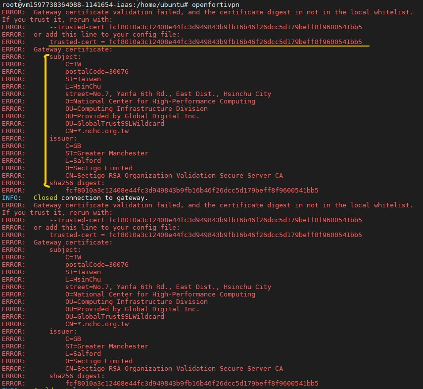
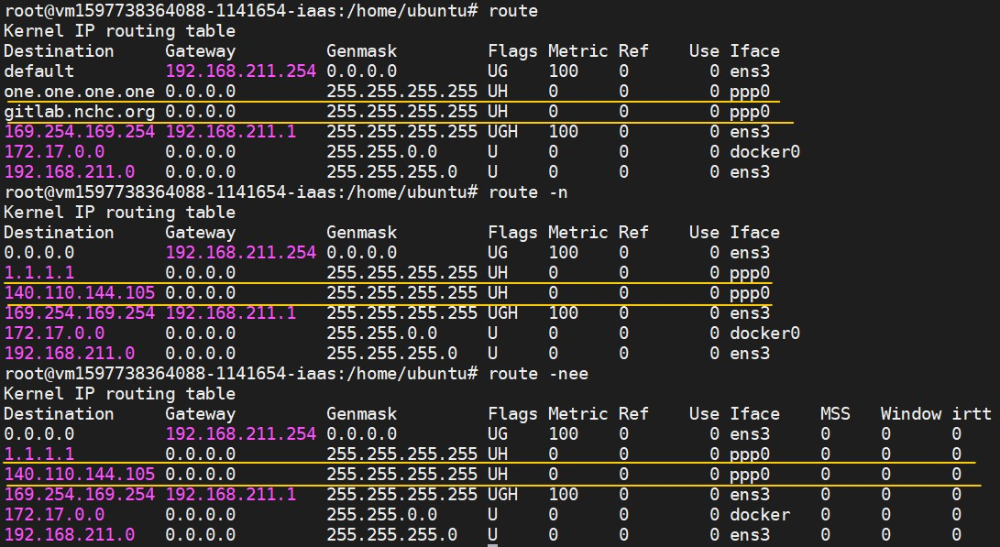
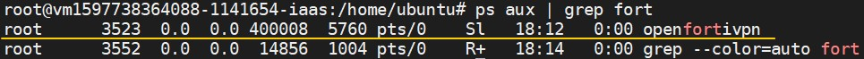

# VPN

有時候會需要從 VCS 訪問外部資源，比如自己公司的 gitlab。  
因為筆者本身是國網中心的員工，因此以國網的 gitlab 為例，因為有鎖網域的原因，所以要先做 VPN 連線，  <br>

本文介紹如何在 TWCC-VCS 安裝 VPN，以及對 NCHC-VPN 連線的相關設定，  
並以 git clone 中心 gitlab(`https://gitlab.nchc.org.tw/`) 的一個專案，做為示範案例。

--

**Content:**

<!-- TOC -->

- [VPN](#vpn)
  - [reference](#reference)
  - [步驟](#步驟)
    - [step01. login to VM，查看相關設定](#step01-login-to-vm查看相關設定)
    - [step02. 安裝與設定 openfortivpn](#step02-安裝與設定-openfortivpn)
    - [step03. 啟動 openfortivpn](#step03-啟動-openfortivpn)
    - [step04. 手動查找要連的服務主機IP並加入](#step04-手動查找要連的服務主機ip並加入)
    - [step05. gitconfig設定](#step05-gitconfig設定)
    - [step06. 切斷 VPN 連線](#step06-切斷-vpn-連線)
  - [設定好之後的流程](#設定好之後的流程)
  - [附註](#附註)
  - [END](#end)

<!-- /TOC -->

---

## reference

- [TWCC VM - NCHC VPN - HackMD](https://hackmd.io/@thomastsai/Sy5BajmMv): 中心同仁 Thomas 提供。
- [Linux 使用 openfortivpn 連線至 Fortinet VPN 伺服器建立 PPP+SSL VPN 教學與範例 - Office 指南](https://officeguide.cc/linux-openfortivpn-fortinet-ppp-ssl-vpn-client-tutorial-examples/): openfortivpn 設定。
- [git错误error: server certificate verification failed. CAfile: /etc/ssl/certs/ca-certificates.crt CRLfile: none - 简书](https://www.jianshu.com/p/7d599bdf370a): git 設定。
- [Git 透過 HTTPS 連線失敗：server certificate verification failed 解決方式 - Office 指南](https://officeguide.cc/git-https-server-certificate-verification-failed-solution/): git 設定。

---

## 步驟

先把所有步驟列出來，再一一介紹說明。

1. login to VM，查看相關設定。  <br>
2. 安裝與設定 openfortivpn。

    > 不要用預設路由，會造成VM斷線失連。  <br>
    > 要先設定 set-routes = 0

3. 啟動 openfortivpn。
4. 手動查找要連的服務主機IP並加入。
5. gitconfig 設定。
6. 切斷 VPN 連線。

--

### step01. login to VM，查看相關設定

登入自己的 VM，在這個階段你可以知道幾件事情，  <br>
因為你可以登入，所以你知道自己 VM 的 IP。  <br>

再加上有幾個指令可以順便玩玩看。(`ifconfig`、`route`、`ip address`)

**ifconfig:**

- [鳥哥的 Linux 私房菜 -- Linux 常用網路指令介紹](http://linux.vbird.org/linux_server/0140networkcommand.php#ifconfig)。

啟動、觀察與修改網路介面的相關參數。  <br>
不過因為我們是用 TWCC-VCS，所以這邊顯示的IP是和連線所使用的IP不一樣。  
但是這部分的知識有點太深，關鍵字是 IP別名(IP aliases)和輔助IP(secondary IP addresses)，有興趣的朋友可以上網自己 google 一下，有機會再和大家分享。


**route:**

- [鳥哥的 Linux 私房菜 -- Linux 常用網路指令介紹](http://linux.vbird.org/linux_server/0140networkcommand.php#route)

兩部主機之間一定要有路由才能夠互通 TCP/IP 的協定，否則就無法進行連線!  <br>
一般來說，只要有網路介面，該介面就會產生一個路由，所以我們的主機一定會有一個 eth0 的介面。(TWCC-VM的初始名稱叫做 ens3)

> - -n  ：不要使用通訊協定或主機名稱，直接使用 IP 或 port number
> - -ee ：使用更詳細的資訊來顯示


如果有安裝 docker，就會多一個 docker 的路由，如下。


**ip address:**

- [鳥哥的 Linux 私房菜 -- Linux 常用網路指令介紹](http://linux.vbird.org/linux_server/0140networkcommand.php#ip_cmd)

這個指令整合了 ifconfig 與 route 這兩個指令!  <br>
不過 ip 可以達成的功能又多更多。



--

### step02. 安裝與設定 openfortivpn

**install vpn tool:**

在安裝 openfortivpn 之前，建議先把 apt-get update 一下，養成好習慣。

```{bash}
sudo su
apt-get update
apt-get install openfortivpn
apt-get install ppp // 這個記得也要安裝。
```

**config vpn connection:**

接著去 openfortivpn 那邊做設定，不要讓它成為預設路由，  <br>
否則一啟動 openfortivpn，VM 的遠端連線就會立馬斷線。(因為你的 VPN 改變了阿XDD~)

```{bash}
sudo su
vim /etc/openfortivpn/config
```

這邊以國網中心為例，  
參數設定 host = 140.110.22.100 也可以。

如果不知道 trusted-cert 要填甚麼，可以先不填寫，  <br>
等等連線後會自然報錯，然後跟你說要加上這一段。

> script 註解是用 `#`，但是 markdown 會被 header 語法影響，所以我才用 `//`。

```{openfortivpn config}
// Fortinet VPN 伺服器
host = vpn-hc.nchc.org.tw
port = 443

// 使用者名稱與密碼
username =
password =

// 不要使用預設路由
set-routes = 0

// 信任指定憑證
trusted-cert = fcf8010a3c12408e44fc3d949843b9fb16b46f26dcc5d179beff8f9600541bb5
```



--

### step03. 啟動 openfortivpn

**start vpn:**

`&`是指在背景執行。  <br>
要等它一陣子，連線需要時間。

```{bash}
sudo su
openfortivpn &
```

連線成功畫面如下。


**view vpn:**

- [鳥哥的 Linux 私房菜 -- 第十六章、程序管理與 SELinux 初探](http://linux.vbird.org/linux_basic/0440processcontrol.php#ps_aux)

```{bash}
// 可以用 fg 觀看背景執行的程式。
// 按下Ctrl+z可跳出。  <br>
fg

    > Ctrl+z

// 類似 ps -l 的指令，可以看目前有哪些程序正在執行。
ps aux | grep fort
```

背景執行的樣子


--

### step04. 手動查找要連的服務主機IP並加入

**look for host you want to connect by vpn:**

但是我們剛剛設定它不是預設路由，所以要和 openfortivpn 說哪一個網站(IP)連線進來要走這條路。

```{bash}
nslookup gitlab.nchc.org.tw
```



**add to vpn route:**

```{bash}
sudo su
route add -host 140.110.144.105/32 dev ppp0
```

--

### step05. gitconfig設定

會生成一個 .gitconfig 的設定檔。  <br>
不同使用者，系統建立 .gitconfig 的路徑不相同。

- ubuntu 使用者: /home/ubuntu/
- root 使用者: /root

```{git}
// 環境變數一次性使用。
// 讓 Git Client 忽略 SSL 憑證檢查。
export GIT_SSL_NO_VERIFY=1
```

```{git}
// 設定 .gitconfig 檔。
// 設定讓 Git Client 永久忽略 SSL 憑證檢查。
git config --global http.sslverify false
```

當然除了上面的用git指令建立 .gitconfig 檔案之外，  <br>
也可以自行 touch .gitconfig file。



--

### step06. 切斷 VPN 連線

有兩種做法，我自己推薦用 pkill的方式。

**disable vpn:**

```{bash}
// fg 方法有用僅限於你過程中沒有 exit。
// 因為每次登入會視為一個新的背景。(我目前的理解啦)
fg

    > Ctrl+c
```

```{bash}
sudo su
pkill openfortivpn
```

---

## 設定好之後的流程

以上設定都完成，就可以成功 git clone 中心的 gitlab 專案囉!!  
以下程式碼，完整地走一遍流程。

```{bash}
// 切換 root 使用者
// VPN 連線。
// 設定特定網域使用 VPN 連線。
// 登出 root 使用者。
sudo su
openfortivpn &
route add -host 140.110.144.105/32 dev ppp0
exit

// 下載公司資源。
git clone https://gitlab.nchc.org.tw/cp4d/das_tutorial_fish.git

// 切換 root 使用者
// 切斷 VPN 連線
// 登出 root 使用者。
sudo su
pkill openfortivpn
exit
```

---

## 附註

如果不知道 /etc/openfortivpn/config 檔案的 trusted-cert 參數。  <br>
就會爆出 error，中間會和你說要加上這一段。



--

VPN 連線成功 + 加入指定的服務主機。

**route:**



**ps aux | grep fort:**



--

如果不想要帳密出現在 VPN 的 config 檔案中，  <br>
可以使用下列變數的方法。

```{bash}
VPN_GATEWAY=140.110.22.100:443
USERNAME=*******
openfortivpn ${VPN_GATEWAY} --username=${USERNAME}
```

---

## END
