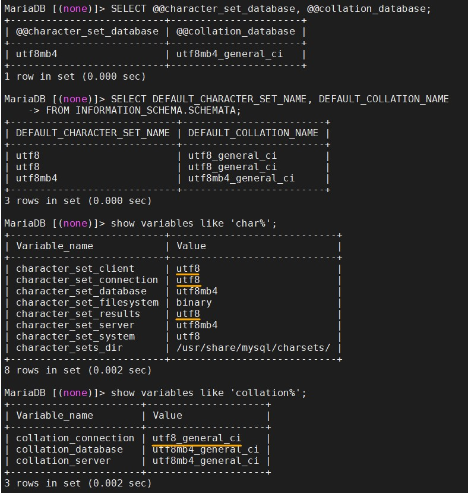

# MariaDB

記錄我在 VCS 上操作 container:MariaDB 的過程，以及一些問題要如何克服。  <br>
部分是從 DockerHub > Database > MariaDB 複製過來。

--

**Content:**

<!-- TOC -->

- [MariaDB](#mariadb)
  - [啟動 container](#啟動-container)
  - [編碼](#編碼)
  - [END](#end)

<!-- /TOC -->

--

**reference:**

- [mariadb - Docker Hub](https://hub.docker.com/_/mariadb)
- [Change MySQL default character set to UTF-8 in my.cnf? - Stack Overflow](https://stackoverflow.com/questions/3513773/change-mysql-default-character-set-to-utf-8-in-my-cnf)

---

## 啟動 container

記得先把連動的實體資料夾開好，並把該資料夾的使用者以及群組設定好，再執行下面指令。

<!-- MYSQL_ROOT_PASSWORD=mariaDB@2020 -->

```{bash}
docker run \
--name some-mariadb \
-e MYSQL_ROOT_PASSWORD=<your_password> \
-v /datamount/mariadb/data:/var/lib/mysql \
-v /datamount/mariadb/conf.d:/etc/mysql/conf.d \
-p 3307:3306 \
-d mariadb

docker run --name some-mariadb -e MYSQL_ROOT_PASSWORD=<your_password> -v /datamount/mariadb/data:/var/lib/mysql -v /datamount/mariadb/conf.d:/etc/mysql/conf.d -p 3307:3306 -d mariadb
```

---

## 編碼

**進入 container、mariaDB:**

```{bash}
docker exec -it some-mariadb bash
mysql -u root -p

  > show databases;
  > exit
```

**查看 mariaDB 的 character-set-server 和 collation-server:**

```{bash}
docker exec -it some-mariadb bash
mysql -u root -p

  > SELECT @@character_set_database, @@collation_database;  <br>
  > SELECT DEFAULT_CHARACTER_SET_NAME, DEFAULT_COLLATION_NAME FROM INFORMATION_SCHEMA.SCHEMATA; // 另一種作法。
  >  <br>
  > show variables like 'char%';  <br>
  > show variables like 'collation%';  <br>
  > exit
```

**修改 Configuration file 與結果:**

即連動資料夾下，新增 my.cnf，修改裡面內容。  <br>
修改之後要重啟 container。

```{mysql}
[client]
default-character-set=utf8

[mysql]
default-character-set=utf8


[mysqld]
collation-server = utf8_unicode_ci
init-connect='SET NAMES utf8'
character-set-server = utf8
```




---

## END
