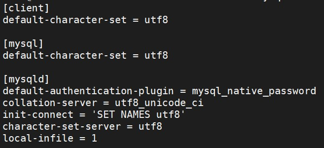

# MySQL

記錄我在 VCS 上操作 container:MySQL 的過程，以及一些問題要如何克服。  <br>
部分是從 DockerHub > Database > MySQL 複製過來。

- 如果連動的資料夾沒有建立，docker會自動建立幫忙建立該路徑的資料夾。但還是建議先建立好。
- 密碼無法登入的問題請看 Database/MySQL，有說明解決方法。
- 如果不想要有密碼問題就 pull 5.7.31版的 MySQL。

--

**Content:**

<!-- TOC -->

- [MySQL](#mysql)
  - [啟動 container](#啟動-container)
  - [密碼無法登入的問題](#密碼無法登入的問題)
    - [my.cnf](#mycnf)
    - [docker-compose](#docker-compose)
  - [看一些變數值](#看一些變數值)
  - [建立新用戶+給予權限](#建立新用戶給予權限)
  - [設定 local file 可以上傳](#設定-local-file-可以上傳)
  - [編碼](#編碼)
  - [Mysql-Client](#mysql-client)
  - [install and login](#install-and-login)
  - [END](#end)

<!-- /TOC -->

--

**reference:**

- [mysql - Docker Hub](https://hub.docker.com/_/mysql?tab=description)

## 啟動 container

記得先把連動的實體資料夾開好，並把該資料夾的使用者以及群組設定好，再執行下面指令。

<!-- MYSQL_ROOT_PASSWORD=MYSQL@2020 -->

```{bash}
docker run \
--name some-mysql \
--env MYSQL_ROOT_PASSWORD=<your_password> \
-v /datamount/mysql/data:/var/lib/mysql \
-v /datamount/mysql/conf:/etc/mysql/conf.d \
-p 3306:3306 \
--detach mysql:latest

//一行指令
docker run --name some-mysql --env MYSQL_ROOT_PASSWORD=<your_password> -v /datamount/mysql/data:/var/lib/mysql -v /datamount/mysql/conf:/etc/mysql/conf.d -p 3306:3306 --detach mysql:latest
```

---

## 密碼無法登入的問題

這主要是因為 Mysql 版本的問題。密碼加密的方式不同。

**reference:**

- [MySQL 8.0 的新密碼加密 plugin 導致 PHP 連線失敗 - Zeroplex 生活隨筆](https://blog.zeroplex.tw/2019/07/mysql-80-plugin-php.html)
- [連線 MySQL 8.0 時，加密方式不相容的解決方法 | IT人](https://iter01.com/443370.html)
- [Andreas Geisler - Berlin based Full Stack Software Developer](http://www.andreasgeisler.com/blog/fatal-error-uncaught-pdoexception-the-server-requested-authentication-method-unknown-to-the-client-caching_sha2_password/2018/11/)
- [Upgrading to MySQL 8.0 : Default Authentication Plugin Considerations | MySQL Server Blog](https://mysqlserverteam.com/upgrading-to-mysql-8-0-default-authentication-plugin-considerations/)
- [MySQL密碼不能登錄的解決辦法 - 每日頭條](https://kknews.cc/zh-tw/code/b2jromj.html)

### my.cnf

到連動資料夾 /datamount/mysql/conf 底下，建立 my.cnf，
在 my.cnf 加上下列資訊，然後重啟 container。  <br>

```{my.cnf}
[mysqld]
default-authentication-plugin = mysql_native_password
```

```{bash}
docker restart some-mysql
```

這樣就可以在 VM 上面，用輸入密碼的方式進入 mysql。
但如果想要在外面用密碼方式登入還需要進入 mysql 做設定。

```{bash}
docker exec -it some-mysql bash
mysql -u root -p
```

```{mysql}
// 看一下 password 的加密方式。
use mysql;
SELECT user, authentication_string, host from user;

// 設定可以用 mysql_native_password 加密方式登入。
// ALTER USER 'root'@'localhost' IDENTIFIED WITH mysql_native_password BY '<your_password>';
ALTER USER 'root'@'%' IDENTIFIED WITH mysql_native_password BY '<your_password>';
FLUSH PRIVILEGES;
```

### docker-compose

或是修改 docker-compose.yml 的 mysql 服務部分，新增一行。(這方法我還沒嘗試過，但應該可行。)

```{docker compose .yml}
command: --default-authentication-plugin=mysql_native_password
```

> 以下是舊的做法，依舊可用，指示步驟比較多一點。  <br>
>  <br>
> **Step01:**  <br>
>  <br>
> 去 /DBdata/mysql/conf 新增 my.cnf。  <br>
> 新增與修改檔案要用 sudo su 權限。  <br>
>  <br>
>  <br>
> ```{my.cnf}  <br>
> [mysqld]  <br>
> skip-grant-tables  <br>
> ```  <br>
>  <br>
> ```{bash}  <br>
> docker restart some-mysql  <br>
> ```  <br>
>  <br>
> **Step02:**  <br>
>  <br>
> 登入 container  <br>
> 登入 mysql，密碼 DAS@mysql2020  <br>
>  <br>
> ```{bash}  <br>
> docker exec -it some-mysql bash  <br>
> mysql -u root -p  <br>
> ```  <br>
>  <br>
> **Step03:**  <br>
>  <br>
> 指定使用資料庫，更新密碼為空。  <br>
>  <br>
> ```{bash}  <br>
> use mysql;  <br>
> SELECT user, authentication_string, host from user;  <br>
> update user set authentication_string='' where user='root';  <br>
> flush privileges;  <br>
> ```  <br>
>  <br>
> **Step04:**  <br>
>  <br>
> 退出mysql，把第一步的skip-grant-tables註釋。再重啟mysql  <br>
>  <br>
> ```{bash}  <br>
> vim my.cnf  <br>
> docker restart some-mysql  <br>
> docker exec -it some-mysql bash  <br>
> mysql -u root -p  <br>
> ```  <br>
>  <br>
> **Step05:**  <br>
>  <br>
> 使用原始加密的密碼 + 權限設定  <br>
>  <br>
> mysql_native_password  <br>
>  <br>
> ```{bash}  <br>
> use mysql;  <br>
> ALTER USER 'root'@'localhost' IDENTIFIED WITH mysql_native_password BY 'DAS@mysql2020';  <br>
> ALTER USER 'root'@'%' IDENTIFIED WITH mysql_native_password BY 'DAS@mysql2020';  <br>
> GRANT ALL PRIVILEGES ON *.* TO 'root'@'localhost' WITH GRANT OPTION;  <br>
> ```  <br>

---

## 看一些變數值

**reference:**

- [查詢 MySQL 對 此帳號 開放(GRANT)哪些權限 | Tsung's Blog](https://blog.longwin.com.tw/2009/06/query-mysql-show-grant-permission-2009/)
- [查詢 MySQL/MariaDB 資料庫的使用者帳號教學 - Office 指南](https://officeguide.cc/how-to-show-list-users-in-a-mysql-mariadb-database/)
- [mysql 查詢 user 帳號及權限 @ Js 片段記憶回顧中心 :: 痞客邦 ::](https://jason0324.pixnet.net/blog/post/42795331-mysql-%E6%9F%A5%E8%A9%A2-user-%E5%B8%B3%E8%99%9F%E5%8F%8A%E6%AC%8A%E9%99%90)

```{bash}
SHOW VARIABLES LIKE 'lower%';

use mysql;
select user, authentication_string, host from user;

// 查有哪些帳號
SELECT User, Host FROM mysql.user;

// 查帳號權限
// SHOW GRANTS FOR <username>;
SHOW GRANTS FOR root;
```

---

## 建立新用戶+給予權限

但是我還不太會給予權限。

```{bash}
// CREATE USER 'newuser'@'%' IDENTIFIED WITH mysql_native_password BY '<your_password>';
CREATE USER 'kvgh'@'%' IDENTIFIED WITH mysql_native_password BY 'kvgh@DB2020';

// 應該是這個，但是這權限有點太大。
// GRANT ALL PRIVILEGES ON *.* TO 'newuser'@'localhost';
GRANT ALL PRIVILEGES ON *.* TO 'kvgh'@'%';
```

---

## 設定 local file 可以上傳

**reference:**

- [MySQL: Enable LOAD DATA LOCAL INFILE - Stack Overflow](https://stackoverflow.com/questions/10762239/mysql-enable-load-data-local-infile)

這樣就可以從程式端上傳資料，也可以用 LOAD 指令上傳local檔案。

```{bash}
SHOW GLOBAL VARIABLES LIKE 'local_infile';
SET GLOBAL local_infile = 1;
// 等價。SET GLOBAL local_infile = 'ON';
// 等價。SET GLOBAL local_infile = true;
```

但是這個設定，經過重啟會失效，所以必須在 my.cnf 中加入指令。

```{my.cnf}
[mysqld]
SET GLOBAL local_infile = 1
```

---

## 編碼

**進入 container、mysql:**

```{bash}
docker exec -it some-mysql bash
mysql -u root -p

  > show databases;
  > exit
```

**查看 mysql 的 character-set-server 和 collation-server:**

```{bash}
docker exec -it some-mysql bash
mysql -u root -p

  > SELECT @@character_set_database, @@collation_database;
  > SELECT DEFAULT_CHARACTER_SET_NAME, DEFAULT_COLLATION_NAME FROM INFORMATION_SCHEMA.SCHEMATA; // 另一種作法。
  >  <br>
  > show variables like 'char%';
  > show variables like 'collation%';
  > exit
```

**修改 Configuration file 與結果:**

即連動資料夾下，新增 my.cnf，修改裡面內容。  <br>
修改之後要重啟 container。

- mysqld 是服務端程序 = 作為 MYSQL Server 的操作指令。
- mysql是命令行客户端程序 = 作為 MYSQL Client 的操作指令

```{my.cnf}
[client]
default-character-set=utf8

[mysql]
default-character-set=utf8

[mysqld]
collation-server = utf8_unicode_ci
init-connect='SET NAMES utf8'
character-set-server = utf8
```

\


**總結 mysql 的 my.cnf:**

```{my.cnf}
[client]
default-character-set = utf8

[mysql]
default-character-set = utf8

[mysqld]
default-authentication-plugin = mysql_native_password
collation-server = utf8_unicode_ci
init-connect = 'SET NAMES utf8'
character-set-server = utf8
local-infile = 1
```

---

## Mysql-Client

要在 Unbuntu 系統上安裝 mysql-client，才可以直接對不同的 DB(for mysql and mariaDB) 做連線。

---

## install and login

-h, --host=name     Connect to host.

```{bash}
sudo apt install mysql-client-core-5.7

// 連線
mysql -h 127.0.0.1 -P 3306
mysql -h <IP> -P 3306 -u root -p
```

---

## END

- [logging - How to see log files in MySQL? - Stack Overflow](https://stackoverflow.com/questions/5441972/how-to-see-log-files-in-mysql): 這是登入記錄或是相關操作的 error，要自己研究測試一下。
