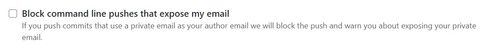

# README

<!-- X副對員工這麼壞= =，那公司的產品我還不用爆! -->
<!-- 把資源用到大爆炸的那一種XDD~ -->

<!-- 目前規劃將此比較作為第12屆-IT邦幫忙鐵人賽。 -->
<!-- 主軸是教學使用台灣的超級電腦-台灣衫二號TWCC，其底下的虛擬運算資源。 -->
<!-- 次要是學習 Docker 操作，架設自己的雲算環境與服務。 -->

這是我利用國網中心的資源 - 台灣衫二號，所學習VCS的過程。  <br>
一方面是善用中心的資源，二來是希望以使用者的角度，記錄學習的過程，或許未來有機會教導其他中心同仁做使用，讓中心資源利用最大化。

> 小知識補充:  <br>
>  <br>
> - 國網中心全名為「財團法人國家實驗研究院國家高速網路與計算中心(National Center for High-performance Computing, NCHC)」  <br>
> - 台灣衫二號是一台超級電腦。國網中心利用此硬體資源，結合廣達、台灣大、華碩等三大國內企業共同組隊建造了AI雲端平台 TWCC(Taiwan Computing Cloud Computing，臺灣AI雲)。  <br>
> - VCS 是其中一個叫虛擬運算的服務(Virtual Computing Service)。

--

**本手冊中的密碼不怕看，因為 port 我有鎖國網的網域!!**

所以基本上要要使用中心的網路才可以連線。

> VPN連線使用:  <br>
>  <br>
> 用VPN連回中心之後，有鎖網域的port依舊不能使用，  <br>
> 後來問過 THomas，是因為新竹的 VPN 似乎不允許這樣操作。

--

**Content:**

<!-- TOC -->

- [README](#readme)
  - [gitbook設定](#gitbook設定)
  - [專案目標](#專案目標)
  - [END](#end)

<!-- /TOC -->

---

## gitbook設定

想自行重製本手冊內容，可以到我的 Github - [littlefish0331/TWCC_VCS_note](https://github.com/littlefish0331/TWCC_VCS_note)，直接做下載的動作。  <br>
下面列出一些可能會遇到的問題，可參考做一些修正。

> 舊版的 repository - [littlefish0331/TWCC_tutorial_old](https://github.com/littlefish0331/TWCC_tutorial_old)。  <br>
> 抓取專案請用 `git clone https://github.com/littlefish0331/TWCC_tutorial_old.git --branch share_note`。--branch 可以用 -b。

--

**結尾設定(end-of-line marker):**

因為 Gitbook 和 Markdown 在換行語法上的不一致，  <br>
所以再用 Gitbook 發布前，請執行下列的程式，對檔案虛幻行的結尾做的修正。

```{bash}
// 在該資料夾目錄下，輸入下列指令。
// 建議是在 wsl(Unix) 環境下執行，但 cmd or powershell 也可以。
// 下面兩個指令等價。
sed --in-place 's/  \r$/  <br>\r/g' *.md
sed -i 's/  \r$/  <br>\r/g' *.md

// 保留原始數據，並在原始檔案後加上副檔名.ori
sed -i.ori 's/  \r$/  <br>\r/g' *.md
```

```{bash}
// 如果 .md 有在資料夾中，則需要迭代執行。
find ./ -type f -name '*.md' | xargs sed -i 's/  \r$/  <br>\r/g'
```

**Github上傳設定:**

要先去自己 Github 帳號的 E-mail settings，  <br>
把「Block command line pushes that expose my email」這個選項取消掉!!



或是去 E-mail settings > Keep my email addresses private，  <br>
使用 Github 所提供的 Email。

**Github換行(CR/LF)設定:**

關鍵字: git config --local core.autocrlf

---

## 專案目標

學習如何在VM上架設各種服務、應用程式、網路設定等等，以及如何讓不同服務之間做溝通。  <br>
到最後打包成果與個體快照，以下是我的 .md檔資料夾結構。

- Docker、Docker-Compose、Dockerfile
- VM
- program: python, R, Rstudio, JS、CSS、HTML, jupyter notebook, Julia, Grafana
- DB: Mysql, BigObject, SQL Server, MariaDB, Postgres, ElasticSearch
- FTP Client, FTP Server
- Git, Gitlab
- VPN
- API Server: Plumber, Flask
- Web Service: Gitbook, Shiny, Jenkins

---

## 目錄

跟著目錄慢慢學習，大概可以一步步學習使用 TWCC 的資源。  <br>
Linux, docker 比較深入的部分，就十分建議看官方的 tutorial!!

- BASIC
  - Initial Status: VCS 剛啟動時的相關設定。(包含 bash_history, apt 看安裝的套件, df 看磁碟狀況。)
  - SSH Connect: SSH 連線設定。
  - TWCC-Port_Setting: Port 設定。
  - Permission: 資料權限、擁有者、群組設定。
  - Mount Disk: 掛載外部硬碟。
  - Environment Varialble: 檢視與新增環境變數。
  - VPN: VCS 中使用 VPN 連線特定網域。
  - Linux Tools: 好用的 linux 指令使用手冊。
  - Linux Tools Cases: linux tools 的綜合實作案例情境(較複雜的cases)。
  - BASIC Note: BASIC 資料夾指令集大成。

- 進階
  - Docker
    - Install Docker and DockerCompose: 從過去專案中，向強者學習的Docker指令紀錄。
    - Docker Command: 常見的 Docker command，包含 docker-compose 指令。
    - Learning from Others: 從過去專案中，像強者學習的Docker指令紀錄。
    - DockerHub Resource: DockerHub 上使用過的 image。
    - Official Tutorial: Docker 官方的教學手冊。
    - Dockerfile: 如何撰寫 Dockerfile。
    - Docker Network: 從過去專案中，學習的 Docker Network 設定。
    - Docker Note: Docker 資料夾指令集大成。
  - Database(基本上就是 Docker 的延伸整理)
    - MSSQL
    - PostgreSQL
    - MariaDB
    - MySQL
    - BigObject
    - ElasticSearch
    - Database Note: Database 資料夾指令集大成。
  - Program(基本上就是 Docker 的延伸整理)
    - R+Rstudio(+python2+python3)
    - jupyter:Python、R、Julia。同一個 dockerHub 來源被我合併在一起。
    - datascienceschool/rpython
    - Grafana
  - CICD
    - Jenkins
- Others
  - Build Gitbook
  - VM and Container story
  - little skills

---

## END
