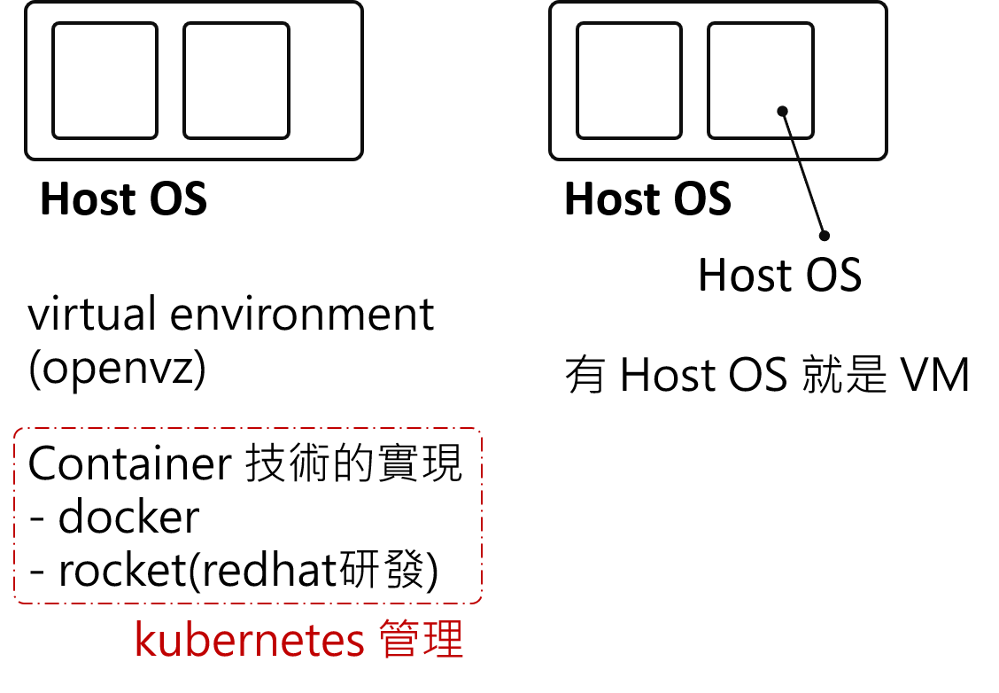

# VM and Container story

紀錄一下聽 Serena 講述這段 VM 和 Container 的歷史故事。   

據說最一開始，依樣事先有獨立環境的需求，   
然後 virtual environmrnt 的技術與概念先出來，這就是我們說的 container 前身。
但是因為當時機器硬體設備的限制，所以常常虛擬環境把實體 Host OS 的資源吃完。   
所以才出現建立一個 Gest OS 的完全獨立環境 - VM技術。

之後，VM的呼聲越來越高。   
但是 virtual environment 的技術也沒放棄，慢慢地發展，   
最終演變成我們現在看到的 containr 技術。   

將 container 技術實現化的，比如 docker 和 rocket(redhat 研發)。   
而 kubernetes 則是管理 container 的技術。

---

## END
